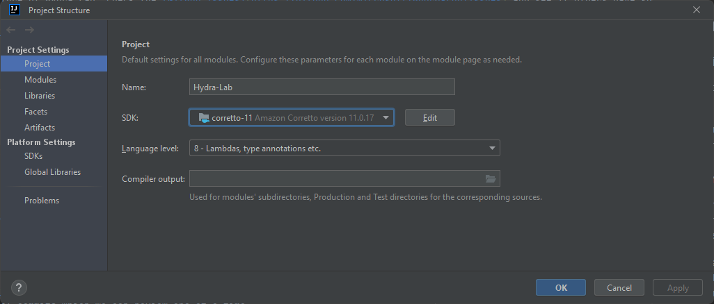

# Contributing to Hydra Lab

We truly welcome any constructive feedback and community contributions to Hydra Lab.
Any interest in making testing better with Hydra Lab is much appreciated!

## Reporting issues and suggesting new features

If Hydra Lab is not working properly, please create an issue on [GitHub Issues](https://github.com/microsoft/Hydra-Lab/issues).

We are happy to hear your ideas for the future of Hydra Lab. Check the [GitHub Issues](https://github.com/microsoft/Hydra-Lab/issues) and see if others have submitted similar issue. You can upvote existing issue or submit a new suggestion.

We always look at upvoted items in [GitHub Issues](https://github.com/microsoft/Hydra-Lab/issues) when we decide what to work on next, and we look forward to hearing your input. Remember that all community interactions must abide by the [Code of Conduct](https://github.com/microsoft/Hydra-Lab/blob/main/CODE_OF_CONDUCT.md).

## Making changes to the code

### Preparing your development environment

After becoming a HydraLab contributor, clone HydraLab code repo and open it with your IDE, [IntelliJ IDEA](https://www.jetbrains.com/idea/) is recommended here.  

Select correto-11 JDK in project structure and click apply.  
Add-ons including JPA Buddy and PlantUML Integration are strongly recommended.  
To learn how to build the code and run tests, follow the instructions in the [README](https://github.com/microsoft/Hydra-Lab/blob/main/README.md).

### Git workflow

We use the [GitHub flow](https://guides.github.com/introduction/flow/) where most
development happens directly on the `main` branch. The `main` branch should always be in a
healthy state which is ready for release.

If your change is complex, please clean up the branch history before submitting a pull request.
You can use [git rebase](https://docs.microsoft.com/en-us/azure/devops/repos/git/rebase#squash-local-commits)
to group your changes into a small number of commits which we can review one at a time.

When completing a pull request, we will generally squash your changes into a single commit. Please
let us know if your pull request needs to be merged as separate commits.

## Review Process

After submitting a pull request, members of the Hydra Lab team will review your code. We will assign the request to an appropriate reviewer. Any member of the community may participate in the review, but at least one member of the Hydra Lab team will ultimately approve the request.
Try looking at [past pull requests](https://github.com/microsoft/Hydra-Lab/pulls?q=is%3Apr+is%3Aclosed) to see what the experience might be like.

## Contributor License Agreement

This project welcomes contributions and suggestions.  Most contributions require you to agree to a
Contributor License Agreement (CLA) declaring that you have the right to, and actually do, grant us
the rights to use your contribution. For details, visit https://cla.opensource.microsoft.com.

When you submit a pull request, a CLA bot will automatically determine whether you need to provide
a CLA and decorate the PR appropriately (e.g., status check, comment). Simply follow the instructions
provided by the bot. You will only need to do this once across all repos using our CLA.
