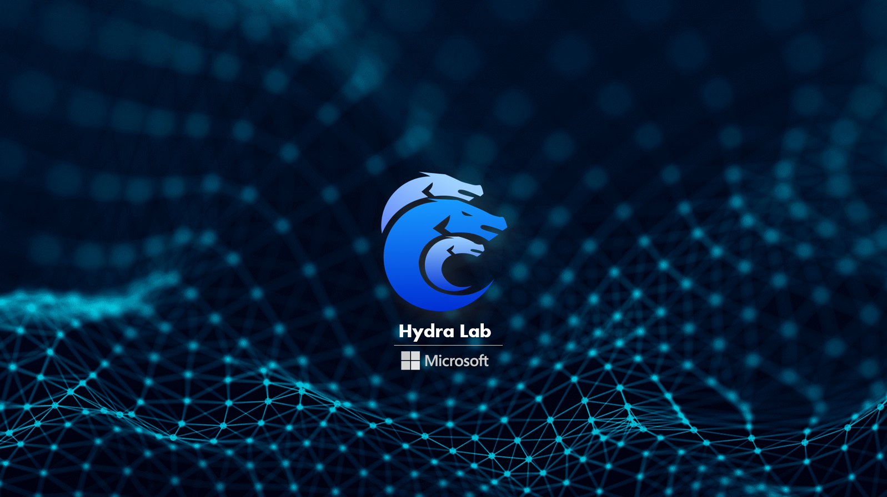

# Microsoft Hydra Lab


Build your own cloud testing infrastructure.



## What is Hydra Lab and what can it do?

The Hydra Lab is the open-source mobile app cloud testing framework that we built from scratch since mid-2021, to empower every mobile dev team to easily set up a cloud test lab utilizing the devices in hand. 

Hydra Lab enables dev team to quickly build a self-manageable and intelligent cloud testing infrastructure. With the help of Hydra Lab, you can:

- Either: Build a new cloud testing network with Hydra Lab released packages.
- Or: Onboard your test device to an existing network with low-cost and small effort.

For more details, see [Introduction: What is Hydra Lab?](https://github.com/microsoft/HydraLab/wiki)


## Get Started
### For Agent User:

1. Register in the device registry center to get an agent id and agent secret: [Current Device Center Frontpage](https://hydradevicenetwork.azurewebsites.net/portal/index.html#/).
2. Set up a blob storage for your agent and configure it in the right position.
3. Download the build artifact and run it with the following args:
```
--app.registry.server=***
--app.registry.id=***
--app.registry.secret=***
--app.blob.connection=***
```


### For Contributor:

The project leverages the open source solution: [spring-dotenv](https://github.com/paulschwarz/spring-dotenv) to access and simulate environment var, so the env.* properties will be read from either your machine ENV or .env file under the resource path.

Contact Shaopeng Bu to access default test env values.

Put the .env file to the following places:
- network_agent/src/main/resources/.env
- network_center/src/main/resources/.env

```bash
npm install
npm run pub
```

There are 2 runnable spring boot projects.

For project network_agent, run with "**--spring.profiles.active=release**" if you want to register to the public center. This will go with the application-release.yml configuration and choose the endpoint there.

[The example Hydra Lab network front page hosted by Microsoft MaX team (AAD login required)](https://hydradevicenetwork.azurewebsites.net/portal/index.html#/)

## Update Notes

[Update Notes](https://github.com/microsoft/HydraLab/wiki/8.-Update-Notes)

## Contribute

See [How to Contribute to Hydra Lab](https://github.com/microsoft/HydraLab/wiki/5.-How-to-Contribute-to-Hydra-Lab)

## License


## Contact Us

If you have questions about ChakraCore, or you would like to reach out to us about an issue you're having, you can reach us as follows:
- Feel free to dive in! [Open an issue](https://github.com/microsoft/HydraLab/issues) or submit PRs.

## References
[Secure a Java web app using the Spring Boot Starter for Azure Active Directory](https://docs.microsoft.com/en-us/azure/developer/java/spring-framework/configure-spring-boot-starter-java-app-with-azure-active-directory)