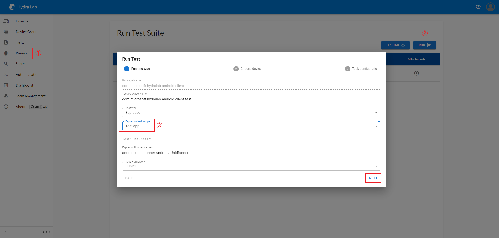
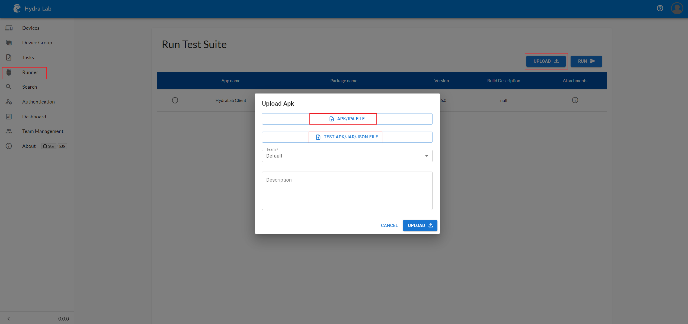

<h1 align="center">Hydra Lab</h1>
<p align="center">Build your own cloud testing infrastructure</p>
<div align="center">

[中文(完善中)](README.zh-CN.md)

[](https://dlwteam.visualstudio.com/Next/_build/latest?definitionId=743&branchName=main)


---

https://github.com/microsoft/HydraLab/assets/8344245/cefefe24-4e11-4cc7-a3af-70cb44974735

[What is Hydra Lab?](#what-is) | [Get Started](#get-started) | [Who are using Hydra Lab?](#who-use-it) | [Contribute](#contribute) | [Contact Us](#contact) | [Links](#links) | [Wiki](https://github.com/microsoft/HydraLab/wiki)
</div>

<span id="what-is"></span>
## What is Hydra Lab?

As mentioned in the above video, Hydra Lab is a framework that can help you easily build a cloud testing platform utilizing the test devices/machines in hand. 

Capabilities of Hydra Lab include:
- Scalable test device management under the center-agent distributed design; Test task management and test result visualization.
- Powering [Android Espresso Test](https://developer.android.com/training/testing/espresso), and Appium(Java) test on different platforms: Windows/iOS/Android/Browser/Cross-platform.
- Case-free test automation: Monkey test, Smart exploratory test.

For more details, see [Introduction: What is Hydra Lab?](https://github.com/microsoft/HydraLab/wiki)

<span id="get-started"></span>
## Get Started

Please visit our **[GitHub Project Wiki](https://github.com/microsoft/HydraLab/wiki)** to understand the dev environment setup procedure: [Contribution Guideline](CONTRIBUTING.md).

**Supported environments for Hydra Lab agent**: Windows, Mac OSX, and Linux ([Docker](https://github.com/microsoft/HydraLab/blob/main/agent/README.md#run-agent-in-docker)).

**Supported platforms and frameworks matrix**:

|  | Appium(Java) | Espresso | XCTest |
| ---- |--------------|---- | ---- |
|Android| &#10004;     | &#10004; | x |
|iOS| &#10004;     | x | x | &#10004; |
|Windows| &#10004;     | x | x |
|Web (Browser)| &#10004;     | x | x |

<span id="quick-start"></span>
### Quick guide on out-of-box Uber docker image

Hydra Lab offers an out-of-box experience of docker image called Uber. You can follow the below steps and start your docker container with a center instance and an agent instance built in:

**Step 1. download and install [Docker](https://www.docker.com)**

**Step 2. run on your machine**

By Default, Hydra Lab will use the local file system as a storage solution, and you may type the following in your terminal to run it:

```bash
docker run -p 9886:9886 --name=hydra-lab ghcr.io/microsoft/hydra-lab-uber:latest
```

**Step 3. Visit the web page and view your connected devices**

> Url: http://localhost:9886/portal/index.html#/ (or your custom port).

Enjoy starting your journey of exploration!

**Step 4. Perform the test procedure with a minimal setup**

Note: For Android, Uber image only supports **Espresso/Instrumentation** test. See "User manual" section on this page for more features: [Hydra Lab Wikis](https://github.com/microsoft/HydraLab/wiki).

**1. To run a test with Uber image and local storage:**
- On the front-end page, go to `Runner` tab and select `HydraLab Client`.
- Click `Run` and change "Espresso test scope" to `Test app`, click `Next`.
- Pick an available device, click `Next` again, and click `Run` to start the test.
- When the test is finished, you can view the test result in the `Task` tab on the left navigator of the front-end page.



**2. To run a test with Uber image and any third-party storage service, additional steps are required before the same steps in `1.`:**
- Download [record_release.apk](https://github.com/microsoft/HydraLab/tree/main/common/src/main/resources/record_release.apk) and [record_androidTest.apk](https://github.com/microsoft/HydraLab/tree/main/common/src/main/resources/record_androidTest.apk) from GitHub.
- On the front-end page, go to `Runner` tab and click `Upload`.
- Select the downloaded app `record_release.apk` for `APK/IPA FILE` and test app `record_androidTest.apk` for `TEST APK/JAR/JSON FILE`.
- Click `Upload` and wait for it to finish.
- Follow the steps of 1. to run the test.

Notice: 
- The package record shown on the page is preloaded for LOCAL storage only. If you try to run it with a different storage type, you will get an error.
- You need to upload the package again if you want to use your own storage service instead of LOCAL storage.
- You can never use more than one storage type in the official service. The above specific situation only occurs in Uber image where the context and database are set up with LOCAL storage as the default option for new users.




### Build and run Hydra Lab from the source

You can also run the center java Spring Boot service (a runnable Jar) separately with the following commands:

> The build and run process will require JDK11 | NPM | Android SDK platform-tools in position.

**Step 1. Run Hydra Lab center service**

```bash
# In project root, switch to react folder to build the Web front.
cd react
npm ci
npm run pub
# Get back to the project root, and build the center runnable Jar. 
cd ..
# For the gradlew command, if you are on Windows please replace it with `./gradlew` or `./gradlew.bat`
gradlew :center:bootJar
# Run it, and then visit http://localhost:9886/portal/index.html#/
java -jar center/build/libs/center.jar
# Then visit http://localhost:9886/portal/index.html#/auth to generate a new agent ID and agent secret.
```

> If you encounter the error: `Error: error:0308010C:digital envelope routines::unsupported`, set the System Variable `NODE_OPTIONS` as `--openssl-legacy-provider` and then restart the terminal.

**Step 2. Run Hydra Lab agent service**

```bash
# In project root
cd android_client
# Build the Android client apk
./gradlew assembleDebug
cp app/build/outputs/apk/debug/app-debug.apk ../common/src/main/resources/record_release.apk
# If you don't have the SDK for Android ,you can download the prebuilt APK in https://github.com/microsoft/HydraLab/releases
# Back to project root
cd .. 
# In project root, copy the sample config file and update the:
# YOUR_AGENT_NAME, YOUR_REGISTERED_AGENT_ID and YOUR_REGISTERED_AGENT_SECRET.
cp agent/application-sample.yml application.yml
# Then build agent jar and run it
gradlew :agent:bootJar
java -jar agent/build/libs/agent.jar
```

**Step 3. visit http://localhost:9886/portal/index.html#/ and view your connected devices**

### More integration guidelines:

- [Test agent setup](https://github.com/microsoft/HydraLab/wiki/Test-agent-setup)
- [Trigger a test task run in the Hydra Lab test service](https://github.com/microsoft/HydraLab/wiki/Trigger-a-test-task-run-in-the-Hydra-Lab-test-service)

<span id="contribute"></span>
## Contribute

Your contribution to Hydra Lab will make a difference for the entire test automation ecosystem. Please refer to **[CONTRIBUTING.md](CONTRIBUTING.md)** for instructions.

### Contributor Hero Wall:

<a href="https://github.com/Microsoft/hydralab/graphs/contributors">
  
</a>

<span id="contact"></span>
## Contact Us

You can reach us by [opening an issue](https://github.com/microsoft/HydraLab/issues/new) or [sending us mails](mailto:hydra_lab_support@microsoft.com).


<span id="ms-give"></span>
## Microsoft Give Sponsors

Thank you for your contribution to [Microsoft employee giving program](https://aka.ms/msgive) in the name of Hydra Lab:

[@Germey(崔庆才)](https://github.com/Germey), [@SpongeOnline(王创)](https://github.com/SpongeOnline), [@ellie-mac(陈佳佩)](https://github.com/ellie-mac), [@Yawn(刘俊钦)](https://github.com/Aqinqin48), [@White(刘子凡)](https://github.com/jkfhklh), [@597(姜志鹏)](https://github.com/JZP1996), [@HCG(尹照宇)](https://github.com/mahoshojoHCG)

<span id="license-trademarks"></span>
## License & Trademarks

The entire codebase is under [MIT license](https://github.com/microsoft/HydraLab/blob/main/LICENSE).

This project may contain trademarks or logos for projects, products, or services. Authorized use of Microsoft trademarks or logos is subject to and must follow [Microsoft’s Trademark & Brand Guidelines](https://www.microsoft.com/en-us/legal/intellectualproperty/trademarks/usage/general). Use of Microsoft trademarks or logos in modified versions of this project must not cause confusion or imply Microsoft sponsorship. Any use of third-party trademarks or logos are subject to those third-party’s policies.

