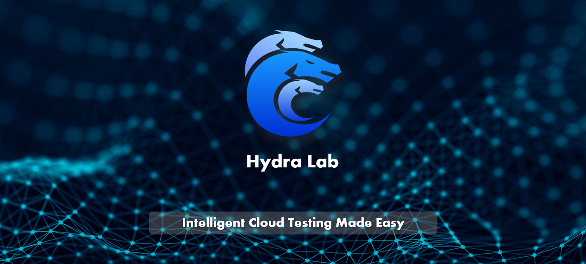
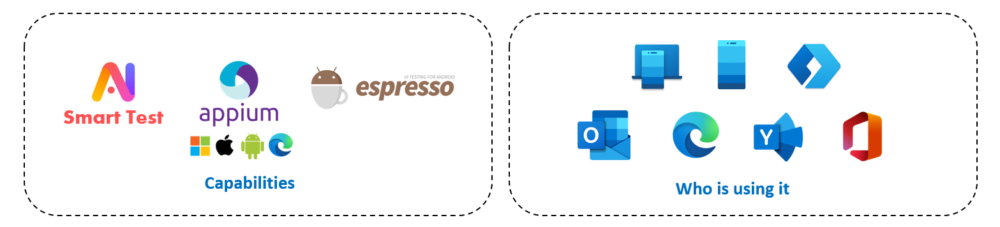

<h1 align="center">Hydra Lab</h1>

Build your own cloud testing infrastructure

---

- [What is Hydra Lab and what can it do?](#what-is)
- [Get Started](#get-started)
    - [Environment](#environment)
    - [For Hydra Lab User](#for-user)
    - [For Contributor](#for-contributor)
- [Update Notes](#update)
- [Contribute](#contribute)
- [Contact Us](#contact)
- [Microsoft Give Sponsors](#ms-give)
- [References](#references)
- [Trademarks](#trademarks)  
- [License](#license)

## What is Hydra Lab and what can it do?

Hydra Lab is a framework that can help you easily build an intelligent cloud testing platform utilizing the devices in hand.

Hydra Lab enables dev team to quickly build a self-manageable and intelligent cloud testing infrastructure. With the help of Hydra Lab, you can:

- Either: Build a new cloud testing network with Hydra Lab released packages.
- Or: Onboard your test device to an existing network with low-cost and small effort.

For more details, see [Introduction: What is Hydra Lab?](https://github.com/microsoft/HydraLab/wiki)

## Get Started

### Environment

#### Supported platform for Hydra Lab agent:

|Hydra Lab agent|
|---- |
| Windows | 
| Mac OSX  |

#### Supported platform and framework for test devices:

|  | Appium | Espresso | 
| ---- |---- |---- |
|Android| &#10004; | &#10004; |
|iOS|&#10004; | x | x |
|Windows|&#10004; | x | 
|Web (Browser)|&#10004; | x | 

#### Install required packages
[Set Up PC Environment](https://github.com/microsoft/HydraLab/wiki/3.-How-to-Deploy-an-Agent#1-set-up-pc-environment)

### For Hydra Lab User:

- [Develop and Package a Test Project](https://github.com/microsoft/HydraLab/wiki/1.-Get-Started-%E2%80%94-Develop-and-Package-a-Test-Project)
- [Run a Test Task in Hydra Lab](https://github.com/microsoft/HydraLab/wiki/2.-Get-Started-%E2%80%94-Run-a-Test-Task-in-Hydra-Lab)
- [How to Deploy an Agent](https://github.com/microsoft/HydraLab/wiki/3.-How-to-Deploy-an-Agent)
- [How to Develop Appium Test Project](https://github.com/microsoft/HydraLab/wiki/4.-How-to-Develop-Appium-Test-Project)

### For Contributor:

- [How to Contribute to Hydra Lab](https://github.com/microsoft/HydraLab/wiki/5.-How-to-Contribute-to-Hydra-Lab)
- [The example Hydra Lab network front page hosted by Microsoft MaX team (AAD login required)](https://hydradevicenetwork.azurewebsites.net/portal/index.html#/)

## Update Notes

[Update Notes](https://github.com/microsoft/HydraLab/wiki/8.-Update-Notes)

## Contribute

We are happy to hear your ideas for the future of Hydra Lab. Check the [GitHub Issues](https://github.com/microsoft/Hydra-Lab/issues) and see if others have submitted similar issue. You can upvote existing issue or submit a new suggestion. Remember that all community interactions must abide by the [Code of Conduct](https://github.com/microsoft/Hydra-Lab/blob/main/CODE_OF_CONDUCT.md).

The Hydra Lab team encourages community feedback and contributions. Thank you for your interest in making Hydra Lab better!

<!--TODO: Generate an image of contributors to keep our README.md in sync. The image can be generated after the status of repo is public.  -->
<!--TODO: For more details, please refer: https://contrib.rocks/preview?repo=microsoft%2Fjust  -->

## Contact Us

Feel free to dive in! If you have questions about Hydra Lab, or you would like to reach out to us about an issue you're having, you can reach us as follows:
- [Open an issue](https://github.com/microsoft/HydraLab/issues) or submit PRs.
- Email us: [hydra_lab_support@microsoft.com](mailto:hydra_lab_support@microsoft.com).

## Microsoft Give Sponsors

Thank you for your contribution to [Microsoft employee giving program](https://aka.ms/msgive) in the name of Hydra Lab:

[@Germey(崔庆才)](https://github.com/Germey)
[@ellie-mac(陈佳佩)](https://github.com/ellie-mac)

## References

- [Secure a Java web app using the Spring Boot Starter for Azure Active Directory.](https://docs.microsoft.com/en-us/azure/developer/java/spring-framework/configure-spring-boot-starter-java-app-with-azure-active-directory) 
- [Appium: Cross-platform automation framework for all kinds of your apps built on top of W3C WebDriver protocol.](https://github.com/appium/appium)
- [Google Android Tools Ddmlib: A ddmlib jar that provides APIs for talking with Dalvik VM.](https://android.googlesource.com/platform/tools/base/+/master/ddmlib/)

## Trademarks

This project may contain trademarks or logos for projects, products, or services. Authorized use of Microsoft trademarks or logos is subject to and must follow [Microsoft’s Trademark & Brand Guidelines](https://www.microsoft.com/en-us/legal/intellectualproperty/trademarks/usage/general). Use of Microsoft trademarks or logos in modified versions of this project must not cause confusion or imply Microsoft sponsorship. Any use of third-party trademarks or logos are subject to those third-party’s policies.

## License

The entire codebase is under [MIT license](https://github.com/microsoft/HydraLab/blob/main/LICENSE).
