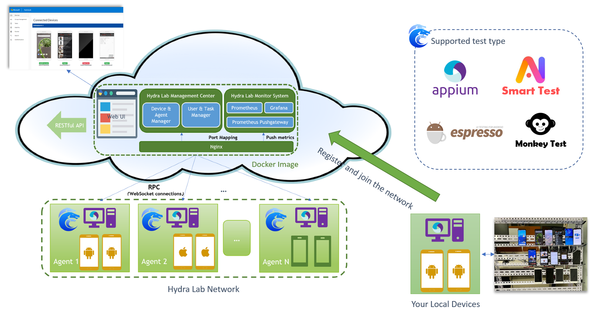

<h1 align="center">Hydra Lab</h1>
<p align="center">Build your own cloud testing infrastructure</p>
<div align="center">

[](https://dlwteam.visualstudio.com/Next/_build/latest?definitionId=743&branchName=main)


</div>

---


- [What is Hydra Lab?](#what-is)
- [Get Started](#get-started)
    - [Environment](#environment)
    - [Quick guide on build and run](#quick-start)
    - [For Hydra Lab User](#for-user)
    - [For Contributor](#for-contributor)
- [Who are using Hydra Lab?](#who-use-it)
- [Contribute](#contribute)
- [Contact Us](#contact)
- [Links](#links)
- [Microsoft Give Sponsors](#ms-give)
- [License & Trademarks](#license-trademarks)


<span id="what-is"></span>
## What is Hydra Lab?

Hydra Lab is a framework that can help you easily build a cloud testing platform utilizing the test devices/machines in hand. 
It enables dev team to quickly build a self-manageable and intelligent cloud testing infrastructure. With the help of Hydra Lab, you can:

- Either: Create a new cloud testing network.
- Or: Onboard your test device to an existing network with a minimized effort.

Capabilities of Hydra Lab include:
- Scalable test device management under the center-agent distributed design; Test task management and test result visualization.
- Powering [Android Espresso Test](https://developer.android.com/training/testing/espresso)
- Appium(Java) test on different platforms: Windows/iOS/Android/Browser/Cross-platform
- Case-free test automation: Monkey test, Smart exploratory test

For more details, see [Introduction: What is Hydra Lab?](https://github.com/microsoft/HydraLab/wiki)

<span id="get-started"></span>
## Get Started

Please visit our **[GitHub Project Wiki](https://github.com/microsoft/HydraLab/wiki)** to understand the dev environment setup procedure: [Contribution Guideline](https://github.com/microsoft/HydraLab/wiki/Contribute-to-the-Hydra-Lab-GitHub-Project)

<span id="environment"></span>
### Environment

**Supported platform for Hydra Lab agent**: Windows, Mac OSX, and Linux (docker).

**Supported platform and framework for test devices**:

|  | Appium(Java) | Espresso | 
| ---- |--------------|---- |
|Android| &#10004;     | &#10004; |
|iOS| &#10004;     | x | x |
|Windows| &#10004;     | x | 
|Web (Browser)| &#10004;     | x | 

<span id="quick-start"></span>
### Quick guide on build and run

Hydra Lab uses [Azure Blob Storage](https://azure.microsoft.com/en-us/products/storage/blobs/) as cloud file storage solution to persist log files, video, app package, etc. Please go to your Azure portal and open an Azure blob storage account, and get the [connection string](https://learn.microsoft.com/en-us/azure/storage/common/storage-configure-connection-string), 
and place it in the env var with the name of BLOB_CONNECTION_STR. Then you can run the center java with the following command:

**Step 1: build and run Hydra Lab center service.**

```bash
# In project root, switch to react folder to build the Web front.
cd react
npm ci
npm run pub
# Get back to the project root, and build the center runnable Jar
cd ..
gradlew :center:bootJar
# Run it, and then visit http://localhost:9886/portal/index.html#/
java -jar center/build/libs/center.jar
# Then visit http://localhost:9886/portal/index.html#/auth to generate a new agent ID and agent secret.
```

**Step 2: build and run Hydra Lab agent service.**

```bash
# In project root, copy the sample config file and update the YOUR_AGENT_NAME, YOUR_REGISTERED_AGENT_ID, and YOUR_REGISTERED_AGENT_SECRET.
cp agent/application-sample.yml application.yml
# Then build agent jar and run it
gradlew :agent:bootJar
java -jar agent/build/libs/center.jar
```

**Step 3: visit http://localhost:9886/portal/index.html#/ and view your connected devices**

Enjoy exploring it! And please refer to this section for more features: [For Hydra Lab User](#for-user)

**Technical design overview:**



<span id="for-user"></span>
### For Hydra Lab User:

- [Trigger a test task run in the Hydra Lab test service](https://github.com/microsoft/HydraLab/wiki/Trigger-a-test-task-run-in-the-Hydra-Lab-test-service)
- [Deploy a test agent service](https://github.com/microsoft/HydraLab/wiki/Deploy-a-test-agent-service)
- [Create an Appium UI Test Automation Project](https://github.com/microsoft/HydraLab/wiki/Create-an-Appium-UI-Test-Automation-Project)

<span id="for-contributor"></span>
### For Contributor:

- [Contribute to the Hydra Lab GitHub Project](https://github.com/microsoft/HydraLab/wiki/Contribute-to-the-Hydra-Lab-GitHub-Project)

<span id="who-use-it"></span>
## Who are using Hydra Lab?

It's already powering the UI test automation of the following Microsoft products:
- Microsoft Phone Link (Windows UWP app) and Link to Windows (Android app)
- Microsoft Launcher (Android)
- Microsoft Outlook/Edge (Android/iOS)
- Microsoft Fluent UI Android/Yammer Android

<span id="contribute"></span>
## Contribute

Your contribution to Hydra Lab will make a difference for the entire test automation ecosystem. Please refer to **[CONTRIBUTING.md](CONTRIBUTING.md)** for contribution instructions.

### Contributor Hero Wall:

<a href="https://github.com/Microsoft/hydralab/graphs/contributors">
  
</a>

<span id="contact"></span>
## Contact Us

Feel free to dive in! If you have questions about Hydra Lab, or you would like to reach out to us about an issue you're having, you can reach us as follows:
- [Open an issue](https://github.com/microsoft/HydraLab/issues/new) or submit PRs.
- Email us: [hydra_lab_support@microsoft.com](mailto:hydra_lab_support@microsoft.com).

<span id="links"></span>
## Links

- [Hydra Lab Release Notes](https://github.com/microsoft/HydraLab/wiki/Release-Notes)
- [Secure a Java web app using the Spring Boot Starter for Azure Active Directory.](https://docs.microsoft.com/en-us/azure/developer/java/spring-framework/configure-spring-boot-starter-java-app-with-azure-active-directory) 
- [Appium: Cross-platform automation framework for all kinds of your apps built on top of W3C WebDriver protocol.](https://github.com/appium/appium)
- [Google Android Tools Ddmlib: A ddmlib jar that provides APIs for talking with Dalvik VM.](https://android.googlesource.com/platform/tools/base/+/master/ddmlib/)

<span id="ms-give"></span>
## Microsoft Give Sponsors

Thank you for your contribution to [Microsoft employee giving program](https://aka.ms/msgive) in the name of Hydra Lab:

[@Germey(崔庆才)](https://github.com/Germey), [@SpongeOnline(王创)](https://github.com/SpongeOnline), [@ellie-mac(陈佳佩)](https://github.com/ellie-mac), [@Yawn(刘俊钦)](https://github.com/Aqinqin48), [@White(刘子凡)](https://github.com/jkfhklh), [@597(姜志鹏)](https://github.com/JZP1996)


<span id="license-trademarks"></span>
## License & Trademarks

The entire codebase is under [MIT license](https://github.com/microsoft/HydraLab/blob/main/LICENSE).

This project may contain trademarks or logos for projects, products, or services. Authorized use of Microsoft trademarks or logos is subject to and must follow [Microsoft’s Trademark & Brand Guidelines](https://www.microsoft.com/en-us/legal/intellectualproperty/trademarks/usage/general). Use of Microsoft trademarks or logos in modified versions of this project must not cause confusion or imply Microsoft sponsorship. Any use of third-party trademarks or logos are subject to those third-party’s policies.

