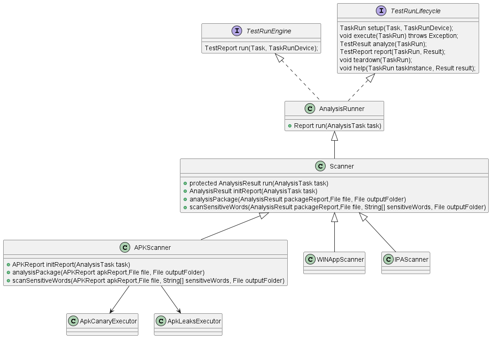
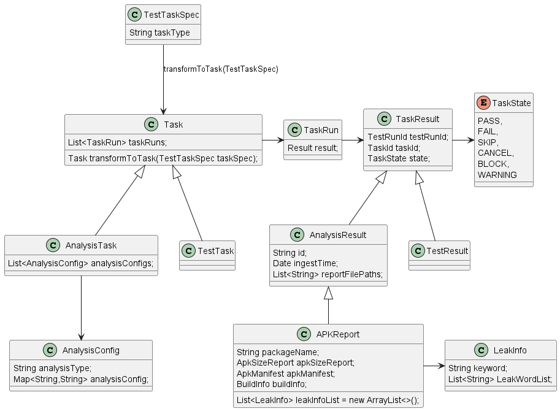
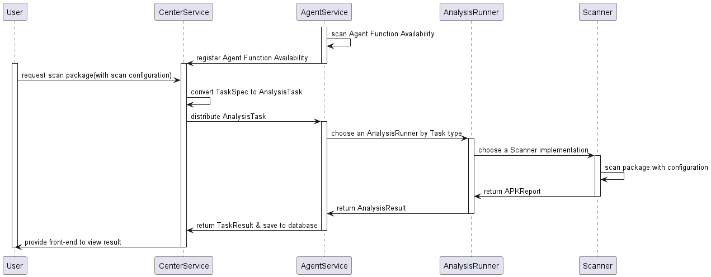

# Installation Package Scanner Design

### Related Documents:
- [package_scanner_design.puml](../UML/package_scanner_design.puml)

### Overview
Package scanner is a component that scans the installation package and extracts the information about the package. 
The information includes the package name, version, and the list of files in the package. 
BTW, the package scanner is also responsible for the package sensitivity verification.
For example, whether any sensitive information such as secrets, tokens, sensitive words, etc. has been leaked.
- Package information scan
  - [APKChecker](https://github.com/Tencent/matrix)
- Package sensitivity scan
  - [APKLeaks](https://github.com/dwisiswant0/apkleaks)
### Architecture Design
##### Agent side implementation
- There would be a new type of Runner **AnalysisRunner** to execute the analysis task, which is characterized by: **no need to operate the mobile or PC device, only the PC-side computing resources can complete the task**
- **Scanner** is an implementation of AnalysisRunner, and other types of AnalysisRunner can be added later, such as: EvaluationRunner
- There would be multiple Scanner implementations, such as **APKScanner**, IPAScanner, WINAppScanner, etc.
- Scanner would be responsible for the following tasks:
  - Scan the installation package and extract the package information
  - Scan the installation package and check whether there is any sensitive information leakage
- Provide AnalysisResult with the scan result

##### Data type

##### Runtime sequence

### Detailed Design

1. Task registration
   1. The type of param that used to trigger task is still TestTaskSpec.
   2. TestTaskSpec would be converted to AnalysisTask or TestTask by the property: **runningType**.
2. Assign task to Agent
   1. There would be a new property named as **availableAnalysisTaskCount** of "com.microsoft.hydralab.common.entity.center.AgentDeviceGroup" saved in Center memory.
   2. When the Agent is online, the availableAnalysisTaskCount would be initialized by the **AgentFunctionAvailability**.
3. Run task on Agent
   1. When the Agent receives the AnalysisTask, it would choose a runner.
   2. The runner would initialize a **AnalysisResult(APKReport)** object to save the scan result.
   3. The runner would invoke multiple executors to prefer the APKReport object by the **AnalysisConfig** list of AnalysisTask.
   4. The APKReport object would be transferred to the Center.
4. Save to Database
   1. There would be 3 tables to save task information: Task, TestTask, AnalysisTask with **InheritanceType.JOINED** strategy. The same property would be saved in the Task table. The unique info of TestTask and AnalysisTask would be saved in the other 2 tables.
   2. For TaskResult, TestResult, AnalysisResult, is the same.