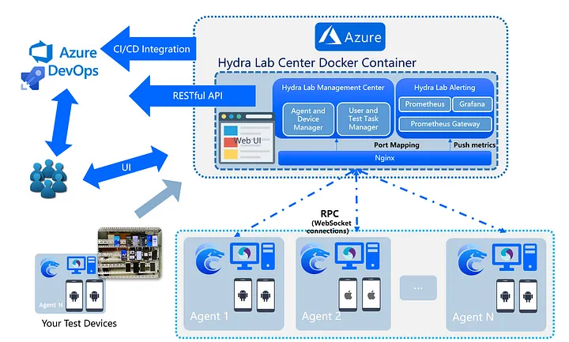
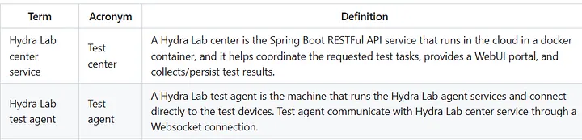
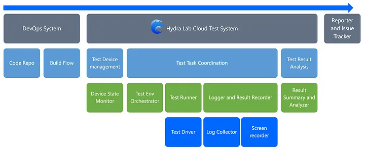
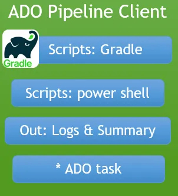
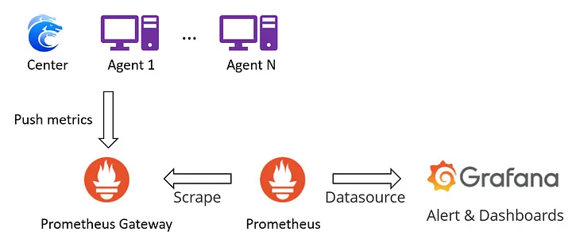
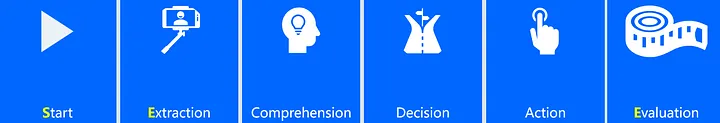
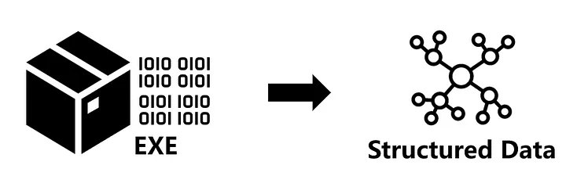
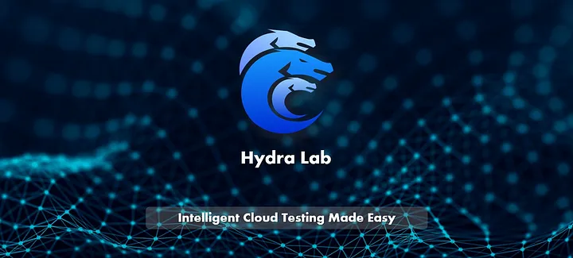

# Hydra Lab ———为微软移动端产品线智能测试赋能

[Hydra Lab: 让智能云测试更简单](https://github.com/microsoft/HydraLab)

## 什么是 Hydra Lab?

下面的视频可以让您大致了解 Hydra Lab 的功能以及使命。

https://github.com/microsoft/HydraLab/assets/8344245/cefefe24-4e11-4cc7-a3af-70cb44974735

总而言之，通过 Hydra Lab，您可以构建一个私有的测试云平台，它基于 RESTful 接口快速集成 DevOps 系统。换句话说，就像您可以拥有一个可管理的私有“Firebase Test Lab”。

## 为什么需要 Hydra Lab?

Hydra Lab 是一个开源的项目，它于 2022 年 12 月在 [github.com/microsoft](https://github.com/microsoft) 下发布。作为一个开源项目，它很好地确保了可控性和可定制化，消除了在集成云测试平台可能遇到的以下问题：

- **可信度**：将调试应用程序包上传到第三方平台是否安全？我们能否完全信任这些平台？使用第三方平台是否有合规性要求？
- **定制性**：第三方平台是否有与我的测试兼容的真实设备？是否支持跨平台场景？
- **成本**：这些平台的定价是否合理？
- **设备共享**：我们能否将我们的设备接入云端，并在不同地区，不同团队之间共享？

Hydra Lab 是一个基于 Appium, Espresso, Maestro, XCTest 等框架打造的一个免费的、可定制的、可信赖的框架。由于它具备集成不同测试框架的胶水代码（适配器）、可复用可扩展的设计以及软件测试生命周期的定义，所以可以支持新的测试框架和智能测试。Hydra Lab 团队始终致力于“让智能云测试更简单”，以及“打造您的智能测试云”，我们也在 Azure DevOps 中建立了标准化的 CI/CD 流程，并使用单元测试，接口测试以及跨平台用户验收测试为质量把关，迄今为止已经发布了 27 个稳定版本。

## HydraLab如何在微软为测试赋能？

在过去的两年中，我们已经将 Hydra Lab 集成到软件开发流程中，我们的内部平台现在为各个移动产品提供无感的自动化测试服务，例如 Phone Link, Link to Windows for Android and iOS, Office Union for Android, Teams Android 等产品。

在微软，我们基于这个框架搭建了一个 Hydra Lab 服务中心，它的协作模式以及架构如下图：



我们将 Hydra Lab 中心端的 docker 镜像部署在 Azure 上作为中心服务，它向内部用户提供了基于 AAD oauth 的 RESTful API，这些户可以使用 Azure DevOps Pipeline 来创建一个任务，将 Espresso 或 Appium 测试任务推送至中心服务。在收到测试请求后，中心服务会选择合适的测试服务器和设备来运行测试任务。测试服务器会选择对应测试框架的驱动，并在测试完成后将结果返回给中心服务。用户可以在中心服务的网页上查看这些测试报告。



用户可以参考 [测试服务器部署手册](https://github.com/microsoft/HydraLab/wiki/Test-agent-setup) 配置测试服务器，并注册到 Hydra Lab 中心服务。





Hydra Lab 通过 [Hydra Lab Azure DevOps 插件](https://marketplace.visualstudio.com/items?itemName=MaXESteam.hydra-lab-alter) 为无缝集成提供支持。我们希望这可以作为 DevOps 流程中的关键组成部分，使整个测试流程完全自动化。



## 开始使用 Hydra Lab

如果您想快速尝试并了解 Hydra Lab ，我们提供了一个一键部署的 docker 镜像，只要您的机器上安装了 docker 和 ADB，输入以下命令：

```
docker run -p 9886:9886 ghcr.io/microsoft/hydra-lab-uber:latest
```

然后，您就可以打开 **http://localhost:9886/portal** ，并开始使用 Hydra Lab 的基本功能，如测试设备管理，测试任务管理，使用各种测试驱动，查看测试报告，测试视频等。

关于更多的使用细节，请参考 GitHub 文档：[如何部署 Hydra Lab 中心服务](https://github.com/microsoft/HydraLab/wiki/Deploy-Center-Docker-Container)。

## 基于 GPT/LLM 的智能测试

**如果有一百万只猴子在一百万个键盘上随机敲一百万年，就可以写出一部莎士比亚的著作。**


今年，我们的目标是将大型语言模型（LLMs）集成到我们的平台中，提高我们在测试结果分析、探索性测试和测试用例生成方面的能力。在软件测试的历史上，“Monkey Test”一直是一个广受欢迎的方法，即在屏幕或 IO 设备上发起随机操作，模仿猴子的偶然行为，来评估应用程序的可靠性。Monkey Test的优势在于它的简单性——不需要维护测试用例——以及作为初始冒烟测试的可能的有效性。然而，它局限于随机操作的粗糙性。想象一下，如果我们能够引入一个更智能的“Monkey”，它可以真正理解应用程序并像人类一样与之交互，这种测试方法是否可以得到改进？




于是我们引入了 SEE（启动-提取-评估）探索模型，它的运行方式如下：首先，启动应用程序并配置环境。然后，确定并理解交互元素，将它们的描述转换为向量或其他计算机可处理的格式。利用这些处理过的数据，制定决策，执行操作，并评估结果。随后，回到提取阶段，获取新的状态。这个循环过程与马尔可夫奖励过程有着相似之处。



探索之后，我们可以基于这些结果数据生成测试用例。生成黑盒测试用例的难点在于黑盒的庞大上下文，很难分析这么庞大的数据量。因此，我们的目标是将其转换为机器学习模型或大型语言模型（LLM）可以处理的结构化数据。这些创新正在 Hydra Lab 进行中。

## 开发实践

我们的核心贡献团队使用 [HydraLab/CONTRIBUTING.md](https://github.com/microsoft/HydraLab/blob/main/CONTRIBUTING.md) 作为开发规范。一般情况下，我们使用 PlantUML 来描述 Hydra Lab 的架构、绘制开发设计图、定义组件和类之间的关系。这样我们就可以轻松地审查一个功能的设计，并在 PR 中提供建议。


我们鼓励在每次新的代码变更中添加单元测试，并且我们也在 CI 中搭建了 BVT，在 CD 中进行了基于接口调用的用户验收测试。如果您有兴趣参与开发，我们随时欢迎您加入团队。

