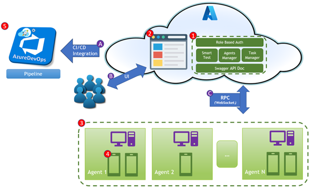
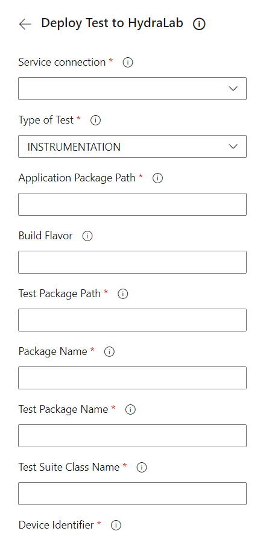

# Introduction

This extension contains a set of deployment tasks which allow you to automatically deploy tests to Hydra Lab from your CI environment. This can streamline the testing process, since you only need to push changes to the specified source control branches, and let your automated build handle the rest.

# Introduction of Hydra Lab Platform

Testing mobile apps or PC software is a crucial element of modern software engineering practice. The push towards continuous integration and continuous delivery (CI/CD) of software requires efficient testing to ensure the builds are constantly stable. Otherwise, the unattended app quality may result in frustrating user experience. The manual UI testing process is time-consuming, which leads us to test automation solutions. However, even with the powerful aid of automated UI tests, we are still faced with several headaches regarding test automation task management, CI/CD integration, test device management and (UI) test case maintenance. 

Hydra Lab is targeted to resolve these hot issues in UI test automation, and striving to provide a more systematic way. Hydra Lab is a center-agent-model-based cloud testing platform, which can enable the dev teams to:
- Easily build a cloud testing infrastructure with highly extensible managed test devices capacity at low cost to support the agile app development and quality-driven workflow.
- Further reduce manual testing and automated testing efforts by leveraging AI and RL (reinforcement learning) techniques. (Exploratory intelligent test empowerment)
- Achieve a consolidated engineering experience for test automation integration with enhanced test result visualization and debuggability.
Eventually, we hope with the help of Hydra Lab the dev team can easily build a cloud-based app testing framework or CI workflow and concentrate more on the development work.

Hydra lab comprises of 5 modules: the management center, the web UI application, device agent and test device, and Azure DevOps Plugin.

1. Management Center: It’s the backend service of Hydra Lab.
    - To access this center securely, authorization and authentication is required.

    - Smart test model allows apps to do automated tests with the help of AI. 

    - The Management Center can manage agents and monitor the running status in real time. 

    - It also manages the test task assignment and the test result processing. 

    - All the provided REST interface will be well documented based on Swagger.

2. UI Application: UI provides an entry for users to access the Management Center. They can login and then check the status of connected test devices, well-visualized reports of test tasks, and statistical information on the web site.

3. Device Agent: To manage the test devices which are connected to management center, Hydra Lab provides an agent tool that can be deployed as a service on the PC. Management Center can send a message to distribute test task request to the corresponding test devices via the agent service. There is no limitation on the number of registered agents, which improves the scalability and device management capacity.

4. Test Device: PC which installs the agent tool or the phone devices which are connected to the PC with agent tool. Currently, Hydra Lab supports two test scenarios: UI automated test for Android applications and cross-platform UI automated test based on Appium.

5. ADO Plugin: Provides multiple ways to integrate with pipeline

    - Select the custom ADO Task provided by Hydra Lab in the pipeline, configure parameters easily, and integrate quickly.

    - Compile and execute the java file by Gradle, invoke the interfaces provided by Hydra Lab to publish test tasks and query test reports.

    - Write shell scripts (such as PowerShell) to invoke the interfaces directly.

    - Pipeline can decide whether the build is successful based on the test report returned from Hydra Lab and publish them to ADO.

# Usage
## Deploy Test to Hydra Lab

| Param name | Explanation | Required | Comment |
|--|--|--|--|  
| appApkPath | Path of APK generated in preceding steps | Yes |  |
| testApkPath | Path of test APK generated in preceding steps | Yes |  |
| pkgName | Package name of the app | Yes |  Set in **Pipeline Variables**  |
| testPkgName | Package name of the test app | Yes |  Set in **Pipeline Variables**  |
| testSuiteName | Class name of the test suite with its package name | Yes | Set in **Pipeline Variables** |
| deviceIdentifier | SN(Serial Number)/ID of specific devices/group for the test to be run on | Yes | Hardcoded in **Pipeline Variables** for now |
| groupTestType | Flag used for specifying whether the test is on a device or a group of devices | Yes | Available vaule: SINGLE(Default): group name represents a single device  REST: rest devices in the specified group  ALL: all devices in the specified group |
| authToken | Authentication token used for Hydra Lab authentication | Yes | Acquired from Hydra Lab owner |
| buildFlavor | Flavor defined in Android project | Yes |  |
| timeOutSeconds | timeout value that client util uses for waiting for testing result | Yes | Need to set manually corresponding to specific app to ensure the time is enough for running tests |
| reportAudience | Identifier of a group of audience | Yes | The groups are pre-defined within the code, and default to **TestLabOwner** |
| extraArgs | Used for sending build related info, such as triggering reason and related build ID | No |  |
| instrumentationArgs | Enabled when need to ignore some test classes within the suite | No | format:   "ignores=classA\|classB\|classC"|
| runningType | Enabled when need to ignore some test classes within the suite | No | Available value:  INSTRUMENTATION (DEFAULT) APPIUM SMART MONKEY |
| frameworkType | Enabled when need to ignore some test classes within the suite | No | Available value:  JUNIT4 (DEFAULT) JUNIT5  |
